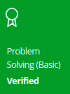
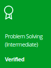
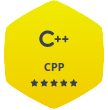

<h4>WHO AM I</h4>


- 👨‍💻 Student && Jr. Back-end developer
- 🌱 Currently learning about Offensive Pentesting
- ⚡ I like solving problem but not in Math :V
- 📫 Reach me:
```sh
python3 -c "$(cat<<EOF
FLAG=int('0b011011010110000101101001011011000111010001101111001110100010000001110111011000010110100001111001011101010111000001110010011010010110000101101101011000100110111101100100011011110010111001101110011001010111010001000000011001110110110101100001011010010110110000101110011000110110111101101101',2)
print(FLAG.to_bytes((FLAG.bit_length()+7)//8,'big').decode())
EOF
)"
```
<br/>

<h4>TECH STACK</h4>
<table>
	<tr>
		<td valign="top" width="20%">
			<h5>Front-end</h5>
			<div align="center">
				
				
				
				
			</div>
		</td>
		<td valign="top" width="40%">
			<h5>Back-end</h5>
			<div align="center">
				
				
				
				
				
				
				
				
			</div>
		</td>
		<td valign="top" width="20%">
			<h5>Database</h5>
			<div align="center">
				
				
			</div>
		</td>
		<td valign="top" width="40%">
			<h5>DevOps</h5>
			<div align="center">
				
				
				
			</div>
		</td>
	</tr>
</table>
<br/>

<h4>BADGES & ACHIEVEMENTS</h4>
<div align="center">
	<a href="https://bit.ly/3o8FShe" target="_blank">
		
	</a>
	<a href="https://bit.ly/3HeGHwg" target="_blank">
		
	</a>
	<a href="https://bit.ly/3ozvy1I" target="_blank">
		
	</a>
	<a href="https://bit.ly/3B7BYdD" target="_blank">
		
	</a>
	<a href="https://www.hackerrank.com/wahoyuz?hr_r=1" target="_blank">
		
	</a>
	<a href="https://www.hackerrank.com/wahoyuz?hr_r=1" target="_blank">
		
	</a>
	<a href="https://www.hackerrank.com/wahoyuz?hr_r=1" target="_blank">
		
	</a>
	<a href="https://bit.ly/3Gjcxqq" target="_blank">
		
	</a>
</div>
<br/>

<h4>SOCIAL MEDIA</h4>
<div align="center">
	<a href="https://github.com/wahoyuz" target="_blank">
		
	</a>
	<a href="https://twitter.com/wahoyuz/" target="_blank">
		
	</a>
	<a href="https://www.linkedin.com/in/wahyu-priambodo-4b12aa209/" target="_blank">
		
	</a>
	<br/>
	<a href="https://t.me/wahoyuz" target="_blank">
		
	</a>
</div>